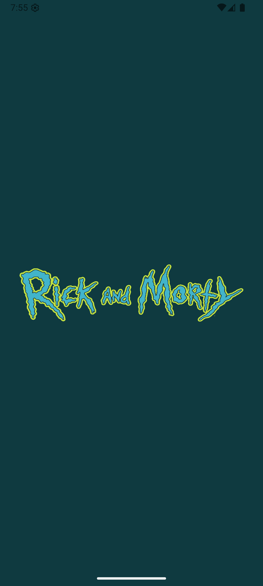
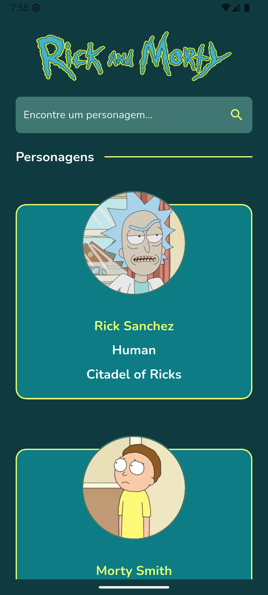
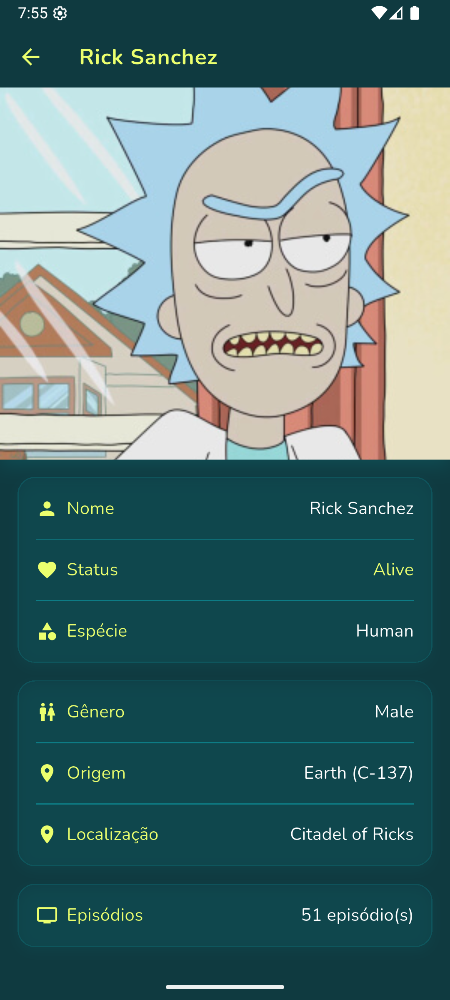

# Rick and Morty App

Este é um aplicativo Flutter desenvolvido como projeto de estudo, focando em boas práticas de desenvolvimento e arquitetura limpa (Clean Architecture).

## Sobre o Projeto

O aplicativo consome a API pública do Rick and Morty para exibir informações sobre os personagens da série. Foi desenvolvido com o objetivo de demonstrar a implementação de:

- Clean Architecture
- Testes unitários
- Consumo de API REST
- Gerenciamento de estado
- UI/UX com Flutter

## Screenshots

    
    
    

## Arquitetura

O projeto segue os princípios da Clean Architecture, sendo dividido em camadas:

- **Data**: Implementação de repositórios e fontes de dados
- **Domain**: Regras de negócio e casos de uso
- **Presentation**: Interface do usuário e gerenciamento de estado

## Testes

Foram implementados testes unitários simples para demonstrar como realizar testes em diferentes camadas da arquitetura, com foco especial na camada de dados e casos de uso.

## Como Executar

1. Clone o repositório
2. Execute `flutter pub get` para instalar as dependências
3. Execute `flutter run` para iniciar o aplicativo

## Recursos Utilizados

- Flutter
- Dio para requisições HTTP
- Get_it para injeção de dependências
- Testes unitários com flutter_test
